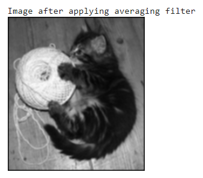
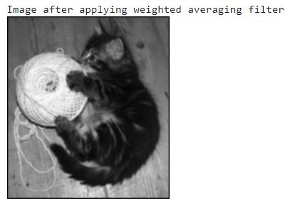
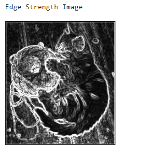
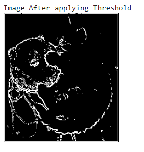

# Computer-Vision-in-Python

In this project, multiple computer vision tasks were performed on the kitty.bmp image. The tasks performed on the image include:

1. Applying averaging filter on the image
2. Applying weighted averaging filter on the image
3. Finding the Sobel Edge Image
4. Applying threshold on the Sobel Edge Image

The code could be run by uploading the convolution.ipynb and kitty.bmp to google.colab.com and then by running all the cells

